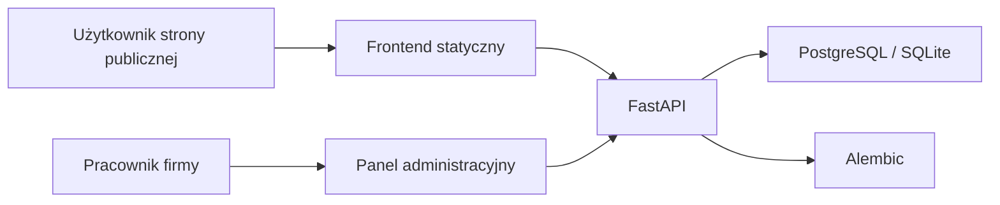

# Architektura systemu

## Cel systemu

Construction CRM Analytics to aplikacja wspierająca firmę budowlaną w obsłudze zapytań klientów, przygotowywaniu ofert oraz analizie aktywności użytkowników na stronie publicznej.

## Warstwy aplikacji



- `frontend/` - strona publiczna, formularz kontaktowy, tracking aktywności i panel administracyjny.
- `backend/app/routers/` - endpointy API podzielone według obszarów: auth, clients, inquiries, offers, tracking, analytics, consents.
- `backend/app/models.py` - modele SQLAlchemy opisujące tabele bazy danych.
- `backend/app/schemas.py` - schematy Pydantic walidujące dane wejściowe i wyjściowe.
- `migrations/` - migracje Alembic utrzymujące wersję schematu bazy danych.
- `tests/` - testy integracyjne API uruchamiane przez pytest.

## Model danych

Główne encje:

- `Client` - klient firmy, dane kontaktowe i powiązana sesja trackingowa.
- `Inquiry` - zapytanie ofertowe klienta.
- `Offer` - oferta handlowa powiązana z zapytaniem.
- `ActivityLog` - zdarzenie aktywności na stronie, np. odsłona, kliknięcie CTA, wysłanie formularza.
- `Consent` - zgoda klienta na kontakt i analitykę.
- `User` - użytkownik panelu administracyjnego z rolą.
- `AuditLog` - dziennik operacji pracowników na danych CRM i danych osobowych.

Relacje:

- klient może mieć wiele zapytań;
- zapytanie może mieć wiele ofert;
- klient może mieć wiele zgód i logów aktywności;
- logi anonimowej sesji są przypisywane do klienta po wysłaniu formularza.

## Role użytkowników

- `admin` - pełny dostęp, zarządzanie użytkownikami, anonimizacja i eksport danych klienta.
- `sales` - praca operacyjna z klientami, zapytaniami i ofertami.
- `manager` - dostęp podglądowy do danych, analityki, zgód i eksportu danych.

## Najważniejsze przepływy

### Formularz kontaktowy

1. Użytkownik odwiedza stronę publiczną.
2. Skrypt trackingowy tworzy `session_id` i zapisuje zdarzenia aktywności.
3. Użytkownik wysyła formularz z wymaganą zgodą.
4. Backend tworzy lub aktualizuje klienta, zapisuje zapytanie i zgodę.
5. Anonimowe logi z tej samej sesji są przypisywane do klienta.

### Obsługa oferty

1. Pracownik loguje się do panelu administracyjnego.
2. Przegląda klientów i zapytania.
3. Tworzy ofertę dla wybranego zapytania.
4. Jeśli oferta ma status `sent`, status zapytania zmienia się na `offer_sent`.

### RODO

System obsługuje:

- zapis zgody klienta;
- anonimizację danych osobowych klienta;
- dezaktywację zgód po anonimizacji;
- eksport danych klienta wraz z zapytaniami, ofertami, zgodami i logami aktywności.
- audit log eksportów, anonimizacji i zmian wykonywanych przez pracowników.

## Kluczowe endpointy API

| Metoda | Endpoint | Dostęp | Opis |
| --- | --- | --- | --- |
| `POST` | `/auth/login` | publiczny | Logowanie i wydanie tokenu JWT |
| `GET` | `/auth/me` | zalogowany | Dane aktualnego użytkownika |
| `POST` | `/auth/users` | admin | Utworzenie użytkownika panelu |
| `GET` | `/clients` | admin, sales, manager | Lista klientów, paginacja i wyszukiwanie |
| `POST` | `/clients` | admin, sales | Utworzenie klienta |
| `DELETE` | `/clients/{client_id}/anonymize` | admin | Anonimizacja klienta |
| `GET` | `/clients/{client_id}/export` | admin, manager | Eksport danych klienta |
| `GET` | `/clients/{client_id}/timeline` | admin, sales, manager | Historia klienta |
| `POST` | `/inquiries` | publiczny | Utworzenie zapytania z formularza |
| `GET` | `/inquiries` | admin, sales, manager | Lista zapytań |
| `POST` | `/offers` | admin, sales | Utworzenie oferty |
| `GET` | `/analytics/kpi` | admin, manager | Wskaźniki KPI |
| `POST` | `/tracking/event` | publiczny | Zapis zdarzenia trackingowego |
| `GET` | `/tracking/logs` | admin, manager | Lista logów aktywności |
| `GET` | `/audit/logs` | admin, manager | Lista operacji administracyjnych |

## Bezpieczeństwo

System stosuje:

- JWT dla panelu administracyjnego;
- role dostępu dla endpointów administracyjnych;
- limit nieudanych prób logowania;
- nagłówki bezpieczeństwa HTTP, w tym CSP, `X-Frame-Options`, `nosniff` i `Referrer-Policy`;
- walidację danych wejściowych przez Pydantic;
- ograniczenie rozmiaru danych trackingowych;
- escapowanie danych renderowanych w panelu administracyjnym.
- blokadę startu w trybie `production`, jeśli użyto domyślnych sekretów.

## Uruchamianie kontroli jakości

```bash
python -m pytest -q
ruff check .
```
